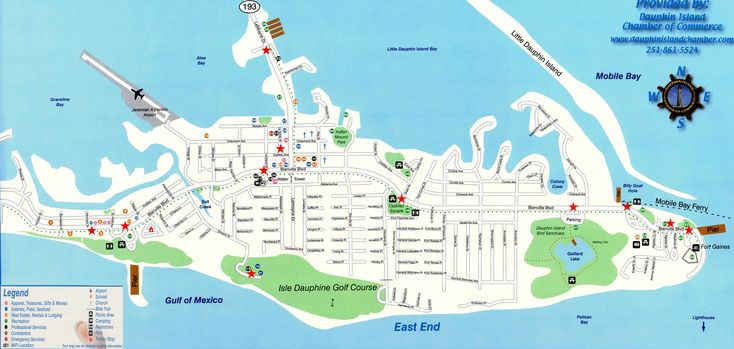

# Executive Summary {.unnumbered}

This report evaluates the risk that a coastal power plant near Dauphin Island, Alabama will be forced to operate at reduced capacity due to elevated gulf water temperatures. The plant relies on water from the gulf as a heat sink and has to reduce output when temperatures exceed 85°F. The goal of this analysis is to see how often this threshold is exceeded and whether these periods correlate with electricity demand.

{fig-align="center" width=50%}

Two publicly available datasets were analyzed in order to address this. Water temperature data from NOAA was used to find periods when temperatures exceed the threshold. Electricity demand data from the U.S. Energy Information Administration (EIA) was used to examine when peak demand occurs. These datasets were cleaned, aligned by date, and summarized using descriptive statistics and visual analysis.

The results show that water temperatures above 85°F occur often during summer months. These periods overlap with increases in electricity demand, which are likely driven by cooling needs. This creates a situation where the plant may have to reduce output at the same time demand is highest.

## Conclusion

The plant faces a strong risk of reduced operating capacity during high demand periods, especially in the summer. This overlap increases the likelihood of strain on the electrical system and reduces flexibility.

## Recommendations

- Evaluate possible other cooling strategies to reduce dependence on the gulf 
- Incorporate temperature risk into planning for future operations

Overall, this analysis indicates that rising water temperatures are a risk that should be accounted for in future planning and decision-making.
