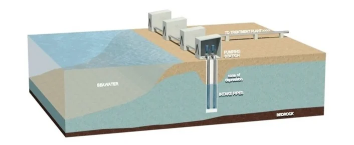

# Introduction

Electric power systems are very sensitive to environmental conditions, particularly temperature. Power plants that rely on nearby water bodies as heat sinks may have operational constraints when water temperatures rise above certain thresholds. As climate change continues, the risk of higher water temperatures becomes a concern.

{fig-align="right" width=40%}

Water temperature data from NOAA shows that temperatures vary seasonally and can become elevated during summer months [@usdepartmentofcommerceNDBCStationPage].

In addition, Electricity demand data from the EIA indicates increased demand during summer due to cooling needs [@EIA].
This overlap creates potential stress on power systems when both supply constraints and demand pressures happen simultaneously.

This study aims to assess the risk that a coastal power plant near Dauphin Island, Alabama will need to operate at reduced capacity. Specifically, it looks at the frequency and timing of high water temperature and compares these periods with patterns in regional electricity demand.

To address this question, data from the National Oceanic and Atmospheric Administration (NOAA) [@usdepartmentofcommerceNDBCStationPage] and the U.S. Energy Information Administration (EIA) [@EIA] are analyzed graphically to evaluate temperature and demand trends.
