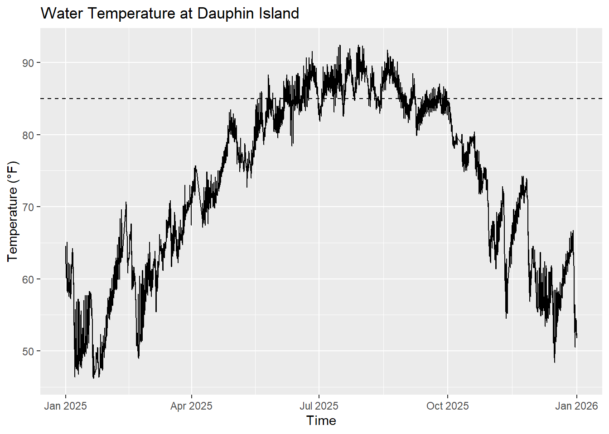
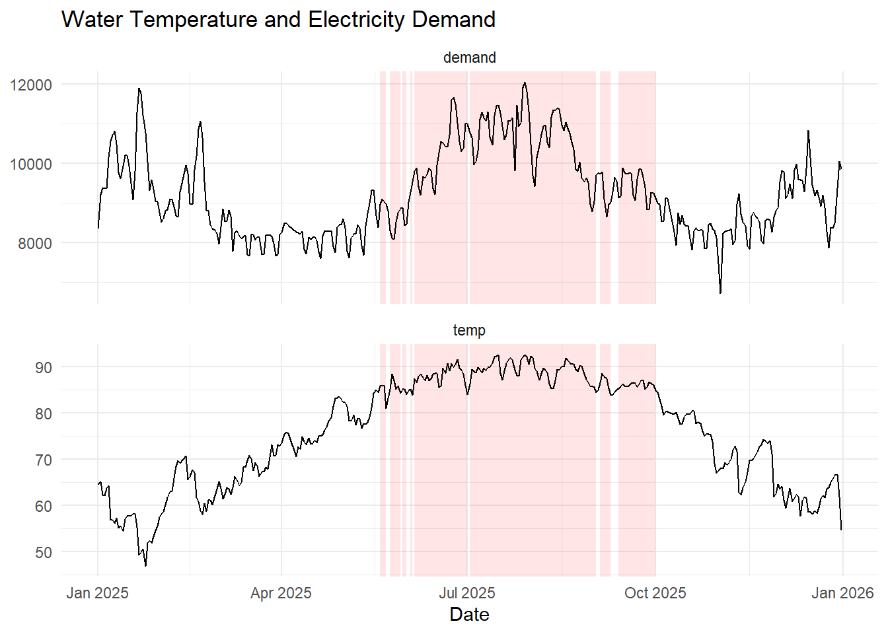

## Why this matters

- Power plants rely on water for cooling  
- High temperatures reduce efficiency  
- Demand is highest when it's hottest  

---

## Objective

Assess risk that a that the power plant must reduce output during high electricity demand  

Key threshold: **85°F water temperature**

---

## Data Sources

- NOAA (water temperature)
- EIA (electricity demand)

- Hourly observations  
- Year: 2025  

---

## Approach

- Convert temperature to °F
- Remove missing and irregular data
- Identify periods > 85°F  
- Compare with electricity demand  

Focus: timing and overlap  

---

## Water Temperature Over Time



---

## Electricity Demand Over Time

```{r}
library(tidyverse)

demand1 <- read_csv("energy.csv")
demand2 <- read_csv("EIA930_BALANCE_2025_Jul_Dec.csv")

demand <- bind_rows(demand1, demand2)

demand_clean <- demand %>%
  mutate(
    datetime = as.POSIXct(`Local Time at End of Hour`, format="%m/%d/%Y %H:%M"),
    demand_mw = as.numeric(`Demand (MW)`)
  ) %>%
  filter(!is.na(datetime), !is.na(demand_mw), demand_mw > 0)

demand_daily <- demand_clean %>%
  mutate(date = as.Date(datetime)) %>%
  group_by(date) %>%
  summarize(demand = mean(demand_mw, na.rm = TRUE))

ggplot(demand_daily, aes(date, demand)) +
  geom_line() +
  labs(
    title = "Daily Average Electricity Demand (2025)",
    x = "Date",
    y = "Demand (MW)"
  ) +
  theme_minimal()
```

---

## Temperature vs Demand



---

## Key Findings

- ~20% of hours exceed 85°F  
- High temperatures occur in summer  
- These periods align with higher demand  

---

## What this means

- Reduced capacity during peak demand  
- Increased system strain  
- Lower operational flexibility  

---

## Recommendations

- Explore alternative cooling methods  
- Plan around summer risk  
- Consider demand management strategies  

---

## Conclusion

- High-temperature risk is **real and seasonal**  
- Overlaps with peak demand  
- Requires proactive planning  

---

## Thank You

Questions?